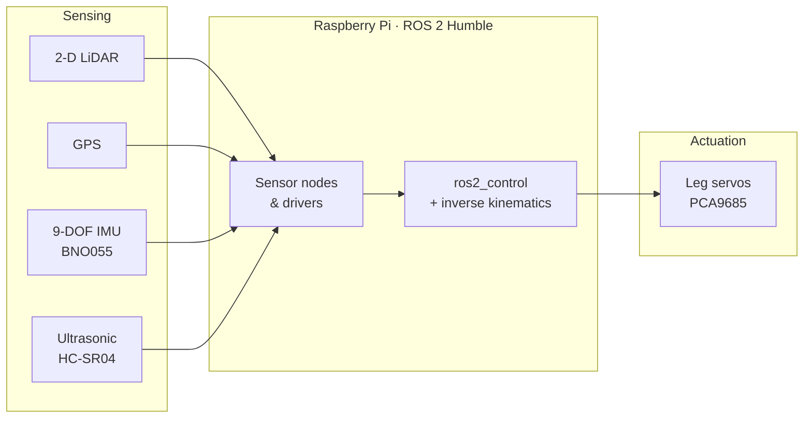

<div align="center">

# AMS — Autonomous Mechanical Spider

**A legged robot running ROS 2 on a Raspberry Pi — fusing LiDAR, GPS, and a 9-DOF IMU, with servo-driven legs commanded through `ros2_control` and inverse kinematics.**


[**▶ Watch the simulation**](https://www.youtube.com/watch?v=_vCqwwgBM8k)

</div>

---

## Overview

AMS is a spider-style legged robot built on **ROS 2 Humble** running on a Raspberry Pi under Ubuntu 22.04. It brings together a sensing stack for perception and localization (2-D LiDAR, GPS, and a 9-DOF IMU) with a motion stack that drives the leg servos through `ros2_control`, using inverse kinematics to translate desired body motion into joint commands. A simulation built on the `ros2_control` demos validates the control pipeline before deploying to hardware.

## System overview



## Hardware & drivers

| Component | Role | Driver / script |
| --- | --- | --- |
| Slamtec RPLiDAR (2-D) | Range sensing | [`sllidar_ros2`](https://github.com/Slamtec/sllidar_ros2) |
| GPS module | Global position | [`nmea_navsat_driver`](https://github.com/ros-drivers/nmea_navsat_driver/tree/ros2) |
| BNO055 (9-DOF IMU, I2C) | Orientation | [`bno055`](https://github.com/flynneva/bno055) + Adafruit libs |
| HC-SR04 | Ultrasonic proximity | `HC-SR04.py` |
| HX711 | Load-cell readout | `hx711`, `hx711-rpi-py`, `hx711py` |
| PCA9685 | Servo PWM driver | `pca9685_simpletest.py`, `servo_test.py` |
| GSM module | Cellular comms | `GSM_PWRKEY.py` |

## Repository structure

| Path | Role |
| --- | --- |
| `ams_ws/` | Primary ROS 2 workspace for the robot. |
| `ros2_ws/` | Additional ROS 2 workspace. |
| `ros2_control_demos/` | Control demos; `example_1` drives the visual simulation. |
| `Adafruit_*_BNO055/` | IMU support libraries. |
| `hx711*/` | Load-cell libraries. |
| `asctec_drivers/` | Additional hardware drivers. |
| `adc_motor_test.py` | Inverse kinematics for leg movement (to be integrated into ROS 2). |
| `*_test.py` | Bring-up scripts for LiDAR, GPS, servos, and other peripherals. |

## Getting started

### Platform

- [Ubuntu 22.04 on Raspberry Pi](https://ubuntu.com/tutorials/how-to-install-ubuntu-on-your-raspberry-pi)
- [ROS 2 Humble](https://docs.ros.org/en/humble/Installation/Ubuntu-Install-Debians.html)

### Dependencies

```bash
# Build tooling
sudo apt install python3-colcon-common-extensions

# tf2 + transforms
sudo apt install ros-humble-turtle-tf2-py ros-humble-tf2-tools ros-humble-tf-transformations

# ros2_control
sudo apt install ros-humble-ros2-control ros-humble-ros2-controllers
```

Resolve workspace dependencies:

```bash
sudo rosdep init
rosdep update
rosdep install -i --from-path src --rosdistro humble -y
```

### Build

```bash
colcon build --packages-select <package_name>
. install/setup.bash
```

## Running

### Sensor drivers

```bash
ros2 launch sllidar_ros2 sllidar_launch.py                 # LiDAR
ros2 launch nmea_navsat_driver nmea_serial_driver.launch.py # GPS
ros2 launch bno055 bno055.launch.py                         # IMU
```

### Simulation

```bash
# Visualize
ros2 launch ros2_control_demo_example_1 view_display.launch.py

# Bring up the controlled robot (source first)
ros2 launch ros2_control_demo_example_1 rrbot.launch.py

# Move the actuators
ros2 launch ros2_control_demo_example_1 test_forward_position_controller.launch.py

# Move the center body
ros2 run ros2_control_demo_example_1 state_subscriber
```

## Demo

<div align="center">

[](https://www.youtube.com/watch?v=_vCqwwgBM8k)

</div>

## Useful links

- [ROS 2 Humble tutorials](https://docs.ros.org/en/humble/Tutorials.html)
- [ros2_control documentation](https://control.ros.org/master/index.html)
- [ros2_control demos](https://github.com/ros-controls/ros2_control_demos)
- [control_toolbox (PID)](https://github.com/ros-controls/control_toolbox/tree/ros2-master/src)

## License

<!-- Add a license file and update this line, e.g. MIT. Note: vendored driver folders carry their own upstream licenses. -->
No top-level license specified yet. Vendored driver folders retain their original upstream licenses.
